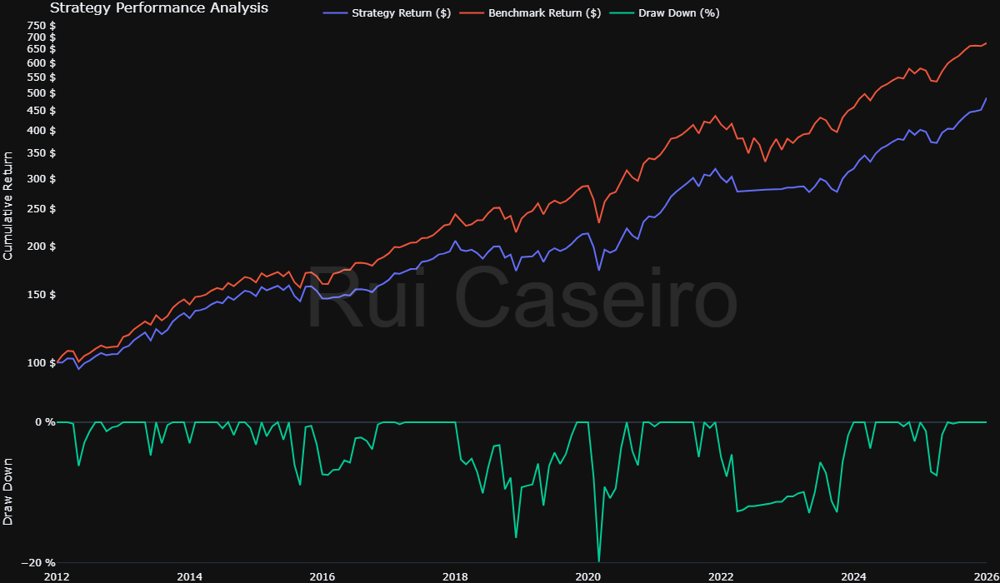
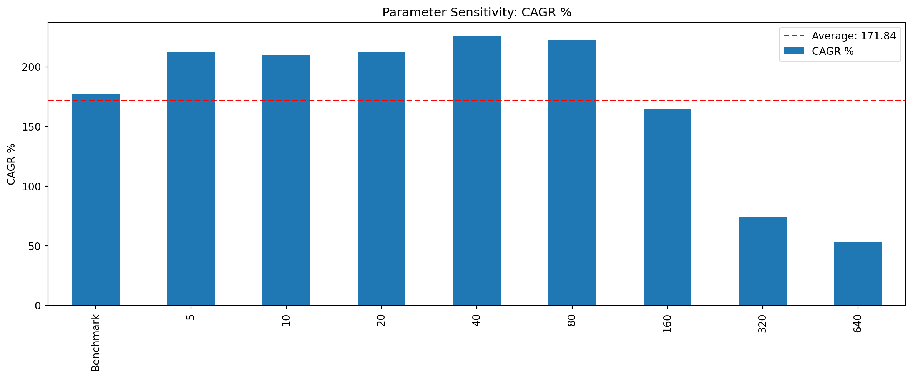
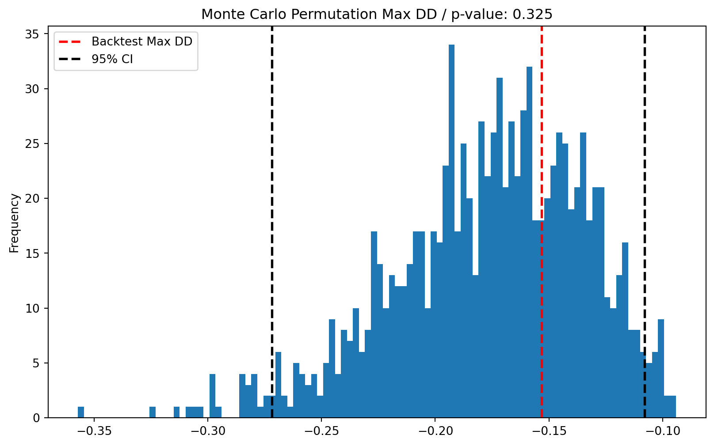
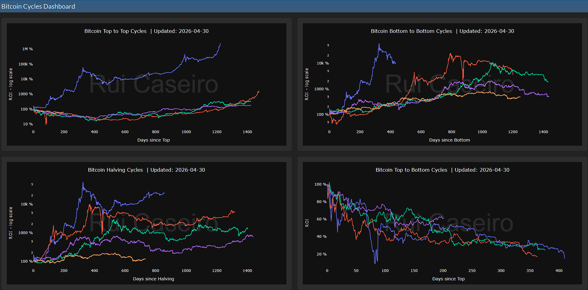
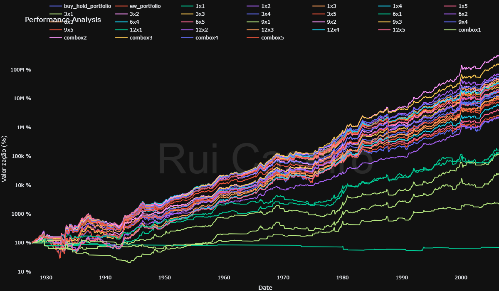

# Hi, I'm Rui!

## about me:
  Financial Analyst with experience in credit risk and corporate financial analysis across European markets. Background in Financial Engineering with strong skills in portfolio analysis, financial modeling and Python.

  **LinkedIn:** [linkedin.com/in/ruicarvalhocaseiro/](https://www.linkedin.com/in/ruicarvalhocaseiro/)  

---

## 👨‍💻 Featured Projects:

### **Portfolio optimization according to Investment Policy Statement (IPS)**
  
#### Key Insights:
  This study constructed and optimized a multi-asset portfolio to meet the Torga family’s IPS return objectives. The process incorporated minimum and maximum constraints across individual assets, asset classes, and geographic exposures to ensure broad diversification and effective risk management. The resulting portfolio achieves an expected return of 8.42% with 13.71% annualized volatility, corresponding to a Sharpe ratio of 0.47.

  

    
     
    <em>Max Sharpe Ratio w/restrictions for Torga Family</em>
  

  - [Full notebook here!](https://github.com/notp1ssed/portfolio/tree/main/assets/python/Portfolio%20optimization%20according%20to%20Investment%20Policy%20Statement%20(IPS))
  
---

### **Dual Momentum Equities OOS performance study**

#### Key Insights: 
  This study evaluated a Dual Momentum TAA strategy over the 2012–2026 out-of-sample period. While the strategy modestly reduced volatility and drawdowns, it underperformed Buy & Hold US equities in both absolute and risk-adjusted terms. Its high equity exposure led to strong correlation with the benchmark, limiting the benefit of defensive allocations during a prolonged secular bull market.

  

    
     
    <em>Dual Momentum Strategy vs SPY</em>
  

  - [Full Interactive report here!](https://notp1ssed.github.io/portfolio/assets/docs/004_DualMomentum_equities.html)

---

### **Systematic Trading Strategy Development and Backtest**

#### Key Insights:
  This study developed a simple moving-average-based trend-following strategy for Bitcoin, capturing the well-documented momentum effect, where rising assets tend to keep trending. Both in-sample and out-of-sample results suggest that even a minimal rule-based approach can deliver attractive risk-adjusted returns in a strongly trending asset. Shorter lookbacks (up to ~80 days) proved more effective than longer ones.
  
  

    
     
    <em>In Sample several lookbacks returns</em>
  

  - [Full Interactive report here!](https://notp1ssed.github.io/portfolio/assets/docs/002_TrendFollowing_Strategy_bitcoin.html)

---

### **A Quantitative Approach to Tactical Asset Allocation OOS performance study**

#### Key Insights:
  This study evaluated the GTAA model by Meb Faber (2013), over the 2013–2026 out-of-sample period. The tactical timing strategies did reduce volatility and drawdowns vs naive portfolios. Although they underperformed, especially 60/40, in both absolute and risk-adjusted terms. Results were driven largely by persistent exposure to the equity sleeves, particularly SPY and EFA, in a sample that strongly rewarded staying invested.
  Inside the tactical group, longer and slower lookbacks worked better than the shorter ones.
  
  

    
     
    <em>Monte Carlo permutation returns MDD 95% CI</em>
  

  - [Full Interactive report here!](https://notp1ssed.github.io/portfolio/assets/docs/005_GlobalTacticalAssetAllocation.html)

---

### **Bitcoin cycles dashboard**

#### Key Insights:
  This dashboard analyzes Bitcoin cycles from four angles: full-cycle top-to-top comparisons, full-cycle bottom-to-bottom comparisons, top-to-bottom drawdowns, and Bitcoin’s halving cycle.
  By aligning current market behavior with historical cycle structures, the dashboard provides a data-driven view of cycle progression, market maturity, and potential timing risk.
  
  

    
     
    <em>Bitcoin Cycles dashboard</em>
  

  - [Full Interactive dashboard here!](https://notp1ssed.github.io/portfolio/assets/python/Bitcoin_cycles_dashboard/000_BTC_Cycles_Dashboard.html)

---

### **Cross-sectional sector momentum strategy - Case Study**

#### Key Insights:
  This study evaluated a cross-sectional sector momentum strategy using the 10 Fama-French industry portfolios over nearly a century of monthly data. Longer and slower momentum formation periods, particularly ROC9 and ROC12, consistently outperformed shorter lookbacks across most metrics. Out-of-sample, the selected ROC12 Top4 strategy achieved a similar CAGR to the Equal-Weight benchmark while substantially reducing volatility and drawdowns, particularly during major market crises. Overall, results suggest that sector momentum’s main strength lies in downside protection and improved risk-adjusted portfolio behavior rather than pure return maximization.
  
  

    
     
    <em>In sample optimization Equity curves</em>
  

  - [Full Interactive report here!](https://notp1ssed.github.io/portfolio/assets/docs/006_SectorRotation.html)

---

### Others python

  - [Final Project Harvard University Python Course](https://github.com/notp1ssed/CS50P-FinalProject)
  
  - [Alpha Research with features engineering and Machine Learning](https://github.com/notp1ssed/portfolio/tree/main/assets/python/ML_AlphaResearch/001_BTC_Features_RandomForests.ipynb)
  
  - [Profitable Machine Learning Bitcoin trading strategy](https://github.com/notp1ssed/portfolio/tree/main/assets/python/ML_AlphaResearch/003_BTC_Features_LinearRegression.ipynb)
  
  - [Comparison of different Machine Learning models as predictors of Bitcoin returns](https://github.com/notp1ssed/portfolio/tree/main/assets/python/ML_AlphaResearch/004_BTC_TradAssets_ML_models.ipynb)
  
  - [Empirical Analysis of Bitcoin Market Regimes](https://notp1ssed.github.io/portfolio/assets/docs/000_MarketRegimes_BTC.html)
  
  - [Empirical Analysis and backtest of Bitcoin Seasonality](https://notp1ssed.github.io/portfolio/assets/docs/001_Seasonality_Backtest.html)

---

## **Excel**

### **ASML Stock Valuation**

#### Key Insights:
  This study conducted a DCF-based valuation of ASML in 2023, concluding that the stock was undervalued given the expected growth in the semiconductor sector. Since then, ASML’s share price has more than doubled, broadly supporting the original investment thesis.

  

    
     
    <em>DCF analysis ASML Equity Valuation </em>
  

  - [Full ASML Stock Valuation repo here!](https://github.com/notp1ssed/portfolio/tree/main/assets/Excel/ASML%20Equity%20Valuation)
  
---

  - [Real Estate Investment Project Evaluation](https://github.com/notp1ssed/portfolio/tree/main/assets/Excel/Real%20Estate%20Investment%20Project%20Analysis)